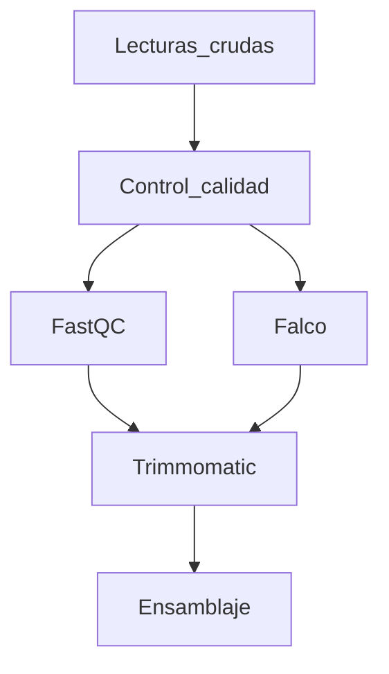

# Análisis de datos metagenómicos de regiones ITS de hongos filamentosos asociados al suelo de la Hacienda "El Prado" - Sangolquí

**Autores:** 
**Ing. Almeida Stefany**, **Ing. Córdova Daniel** y **Ing. Drouet Ariana**

**Fecha:**  marzo 2024

## Introducción

El informe será un documentos en Github en formato Markdown (método de escritura, basado en un formato de texto plano).

Aquí vemos la diferencia entre un procesador de texto (tipo Word) vs Markdown, abiertos en un editor de texto plano. 


Les dejo algunos formatos para el uso :+1: :

# Antecedentes

La ausencia de estudios previos sobre la microbiota fúngica en los suelos del sector de Horticultura y Fruticultura de la Hacienda “El Prado” - IASA I, ubicada en la provincia Pichincha, cantón Rumiñahui, parroquia Sangolquí, destaca la necesidad de realizar esta investigación. Un proyecto que implica la evaluación pionera de la diversidad de hongos filamentosos, principalmente en aquellos con potencial benéfico para la biorrecuperación de los suelos. 


# Objetivos

## Objetivo general
Analizar los datos metagenómicos de las regiones ITS amplificadas de hongos filamentosos utilizando herramientas bioinformáticas.

## Objetivos específicos
* Realizar el control de calidad de los datos crudos de secuencia de las regiones ITS por medio de la herramienta FASTQc en terminal de Linux.
* Identificar molecularmente a las especies de hongos filamentosos mediante un BLASTN del NCBI.
* Extraer la información taxonómica con la alineación de las secuencias consenso mediante MSA en T-coffee y analizarla en la plataforma Galaxy Europe. 


## 1. Titulos
```
# Título primer nivel
## Título segundo nivel
###  Título tercer nivel
```
Se visualiza así:
# Título primer nivel
## Título segundo nivel
###  Título tercer nivel

## 2. Texto en negrita
```
**Hola**
```
**Hola**

## 3. Texto en cursiva

```
*Hola*
```
*Hola*

## 4. Superíndice y subíndice
```
Este es un <sub>subíndice</sub> 
Este otro es un <sup>superíndice</sup> 
```
Este es un <sub>subíndice</sub> 

Este otro es un <sup>superíndice</sup>

## 5. Adicionar línea de comando

````
```
Mira, puedes ver las comillas y formato
```
````
Se ve así:

```
Mira, puedes ver las comillas y formato
```
## 6. Links
```
Este sitio fue construido usando [GitHub](https://pages.github.com/)
```
Este sitio fue construido usando [GitHub](https://pages.github.com/)

## 7. Listas
```
Usa * - o + por ejemplo:
* Empezamos en 3
+ Empezamos en 2
- Empezamos en 1
* 0
```

Visualizamos así:
* Empezamos en 3
+ Empezamos en 2
- Empezamos en 1
* 0

## 8. Creaciones de diagramas

Creando un diagrama parcial  de pipeline:
````

````


Puede aprender sobre Github en la [Guía de inicio rápido](https://docs.github.com/es/get-started/start-your-journey)
